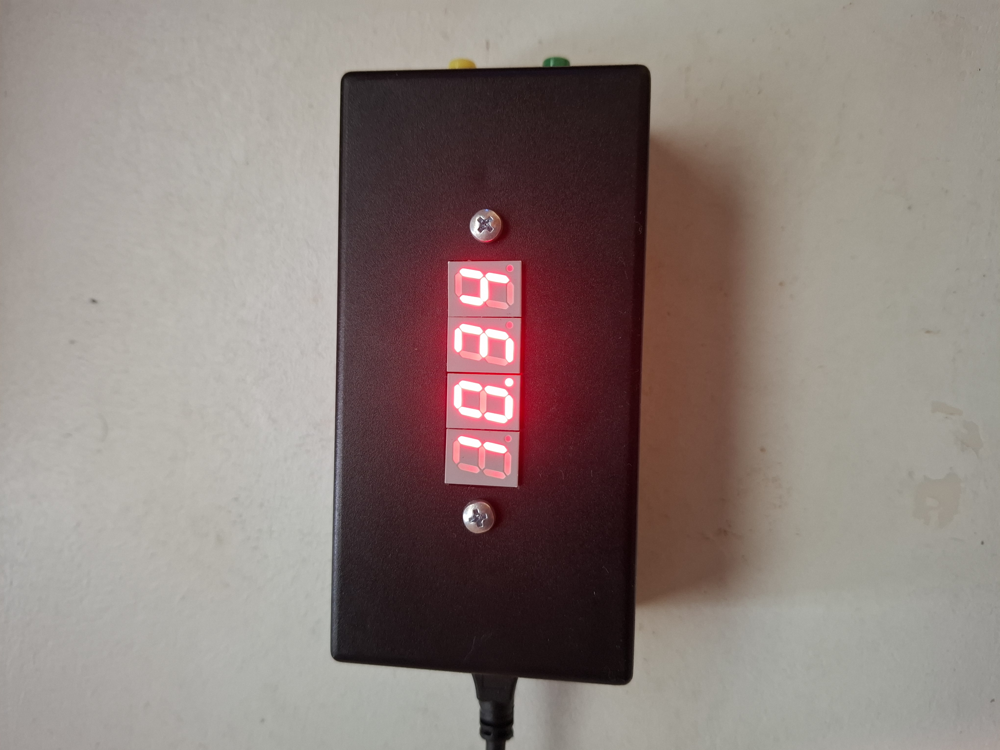
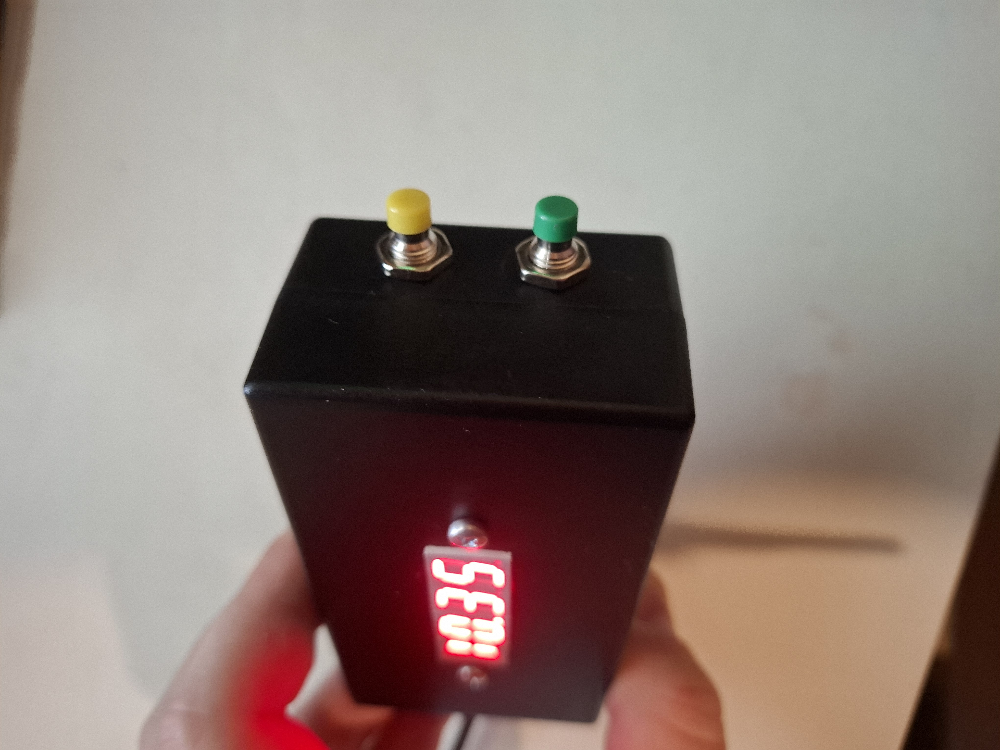
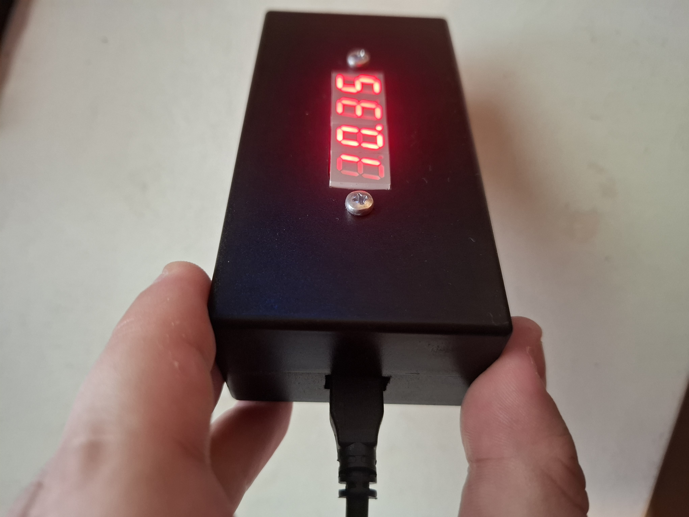

## clock-project

# Description and functions
This is an electronics project made in collaboration with Akuli (https://github.com/Akuli) at our uni. It's a working clock.
You set the time using the two buttons; the yellow button chooses the 'state', choosing from 'normal', 'hours', or 'minutes'. 
In the 'normal' state, the clock works normally, and you can't set the time in any way. In the 'hours' state, you can increment the hours by one from 0-23, 
and in the 'minutes' state you can increment the minutes by one from 0-59. You increment the hours / minutes using the green button.
If you go above 23 hours while setting the hours, the time resets to 00:00. The same doesn't happen if you're at 23 hours and go above 59 minutes.
There isn't a function where if you go above 59 minutes, the hours increment by one. This makes it a bit more convenient to set the time.
This wasn't a deliberate choice, but it works better in my opinion than if the hours incremented while going over 59 minutes.
Since there isn't an option to decrement the time right now, imagine that you're setting the minutes, and you accidentally press one time too many.
Then you'd have to reset the minutes by incrementing, and this would increment the hours by one, and you'd have to also decrement the hours by one.
It would be more annoying than what we have currently.

There is also an easter egg if you press the two buttons simultaneously.

The clock is powered using the raspberry pi pico, using a microusb-usb cable to connect the pico to a power plug and the plug to a wall socket.
Currently there's no batteries in the clock, so for example in the case of an outage, you wouldn't have power to the clock, but there are plans
to add batteries to the clock. With the batteries, you also could have the clock working while it isn't plugged into a socket for a while, and also, 
you wouldn't have to set the time each time that the clock is unplugged (as long as the batteries last). I currently imagine that you'd have to have 
the clock draw power from the batteries all the time, so that when you unplug the clock from the wall, you wouldn't get a delay between unplugging 
and the batteries activating, so to speak, and the clock probably resetting due to this. 

# Images

Here we see the clock's displays.

The buttons used to set the time.

The micro-usb port.